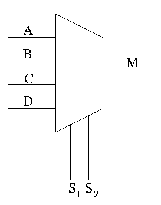

In digital electronics, a multiplexer or MUX is a device that selects one of several digital input signals and forwards the selected input into a single output line. MUXes are designed as electronic selector switches, where a multiplexer of 2n inputs has n select lines to determine which input line to send to the output. A demultiplexer (DEMUX) performs the opposite function, taking a single input signal and routing it to one of many output lines. In this module, we will learn about the implementation of 4 X 1 MUX.

### What you will learn:

Through this interactive experiment, you will:

- **Understand the fundamentals** of data selection in digital circuits using multiplexers
- **Design and analyze** 2X1 multiplexer circuits for basic data selection
- **Construct 4X1 multiplexer circuits** that handle multiple input data lines
- **Build higher-order multiplexers** using cascading techniques for complex data routing
- **Explore real-world applications** of multiplexers in processors, communication systems, and digital devices

### Why are multiplexers important?

Multiplexers are fundamental building blocks in digital systems that enable efficient data routing and selection. They are essential components in processors for register selection, memory addressing, and data path control. In communication systems, multiplexers allow multiple signals to share a single transmission line, maximizing bandwidth utilization. Understanding multiplexer circuits will give you insight into how digital systems efficiently manage and route data between different components.

