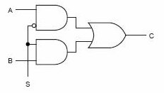
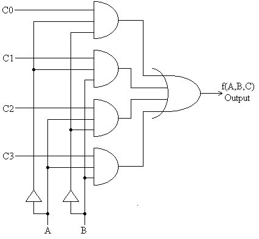

### Multiplexer Fundamentals

An electronic multiplexer can be considered as a multiple-input, single-output switch, and a demultiplexer as a single-input, multiple-output switch. In digital systems, multiplexers are essential components that enable data selection and routing based on control signals.

### 2 X 1 Multiplexer

A 2-to-1 multiplexer is the simplest form of multiplexer that selects one of two input data lines and forwards it to the output based on a single select line. It consists of two data inputs (I0 and I1), one select input (S), and one output (Z).

#### Principle of Operation

In digital circuit design, the selector wires are of digital value. In the case of a 2-to-1 multiplexer, a logic value 0 of S would connect I0 (input A) to the output while a logic value 1 of S would connect I1 (input B) to the output. In larger multiplexers, the number of selector pins is equal to log2n where n is the number of inputs.

#### Logic Equations

A 2-to-1 multiplexer has a boolean equation where A and B are the two inputs, S is the selector input, and Z is the output:

**Z = (A · S') + (B · S)**

This equation shows that:

- When S = 0: Z = A (since S' = 1 and the first term dominates)
- When S = 1: Z = B (since S = 1 and the second term dominates)

#### Key Features

- Simple design using basic logic gates (AND, OR, NOT)
- Single select line controls data path selection
- Forms the building block for larger multiplexers
- Enables 2-to-1 data routing in digital systems
- Can be implemented using transmission gates for better performance

#### Truth Table

| S   | A   | B   | Z   |
| --- | --- | --- | --- |
| 0   | 0   | 0   | 0   |
| 0   | 0   | 1   | 0   |
| 0   | 1   | 0   | 1   |
| 0   | 1   | 1   | 1   |
| 1   | 0   | 0   | 0   |
| 1   | 0   | 1   | 1   |
| 1   | 1   | 0   | 1   |
| 1   | 1   | 1   | 1   |

#### Applications

- Basic data selection in digital circuits
- Simple switching applications
- Building block for larger multiplexer designs
- Input selection in basic digital systems
- Educational demonstrations of data routing concepts

### 4 X 1 Multiplexer

A 4-to-1 multiplexer selects one of four input data lines and forwards it to the output based on two select lines. It consists of four data inputs (I0, I1, I2, I3), two select inputs (S1, S0), and one output (Y). This is a more complex multiplexer that demonstrates the scalability of multiplexer design.

#### Principle of Operation

Larger multiplexers are also common and require ceil(log2n) selector pins for n inputs. Other common sizes are 4-to-1, 8-to-1, and 16-to-1. Since digital logic uses binary values, powers of 2 are used (4, 8, 16) to maximally control a number of inputs for the given number of selector inputs.

The 4X1 multiplexer uses a 2-bit select code (S1S0) to choose which input appears at the output:

- S1S0 = 00: Output = I0
- S1S0 = 01: Output = I1
- S1S0 = 10: Output = I2
- S1S0 = 11: Output = I3

#### Logic Equations

**Y = (I0 · S1' · S0') + (I1 · S1' · S0) + (I2 · S1 · S0') + (I3 · S1 · S0)**

This equation shows that only one input is selected at a time based on the select line combination.

#### Key Features

- Four data inputs with two select lines providing 2² = 4 combinations
- Only one input is connected to output at any given time
- Can be constructed using 2X1 multiplexers in a hierarchical manner
- Foundation for building larger multiplexers (8X1, 16X1, etc.)
- Widely used in data routing and selection applications
- Enables efficient bandwidth utilization in digital systems

#### Truth Table

| S1 | S0 | I3 | I2 | I1 | I0 | Y   |
| ------------- | ------------- | ------------- | ------------- | ------------- | ------------- | --- |
| 0             | 0             | x             | x             | x             | 0             | 0   |
| 0             | 0             | x             | x             | x             | 1             | 1   |
| 0             | 1             | x             | x             | 0             | x             | 0   |
| 0             | 1             | x             | x             | 1             | x             | 1   |
| 1             | 0             | x             | 0             | x             | x             | 0   |
| 1             | 0             | x             | 1             | x             | x             | 1   |
| 1             | 1             | 0             | x             | x             | x             | 0   |
| 1             | 1             | 1             | x             | x             | x             | 1   |

**Note:** x represents "don't care" conditions - the value can be either 0 or 1 without affecting the output.

#### Applications

- **Data Path Selection**: Choosing between multiple data sources in processors
- **Memory Address Decoding**: Selecting memory banks or registers
- **Communication Systems**: Time-division multiplexing for efficient data transmission
- **Arithmetic Logic Units (ALUs)**: Selecting different operational inputs
- **Digital Signal Processing**: Routing signals in DSP systems
- **Microprocessor Design**: Register file selection and data bus management

### Cascading Multiplexers

Multiple smaller multiplexers can be cascaded to create larger multiplexers. For example, an 8X1 multiplexer can be built using two 4X1 multiplexers and one 2X1 multiplexer. This hierarchical approach provides:

#### Benefits of Cascading

- **Modularity**: Reuse of smaller, well-tested components
- **Scalability**: Easy expansion to larger input counts
- **Cost Efficiency**: Optimal use of available IC packages
- **Design Flexibility**: Ability to create custom input/output configurations

#### Implementation Strategy

For an 8X1 multiplexer using 4X1 units:

1. Use two 4X1 multiplexers for the first stage (inputs I0-I3 and I4-I7)
2. Use one 2X1 multiplexer for the final stage to select between the two 4X1 outputs
3. Use the most significant select bit to control the final 2X1 multiplexer
4. Use the remaining select bits to control both 4X1 multiplexers

### Comparison with Demultiplexers

| Feature      | Multiplexer (MUX)           | Demultiplexer (DEMUX)                 |
| ------------ | --------------------------- | ------------------------------------- |
| Function     | Many inputs → One output    | One input → Many outputs              |
| Data Flow    | Convergent                  | Divergent                             |
| Applications | Data selection, routing     | Data distribution, decoding           |
| Common Uses  | Input selection, data paths | Address decoding, signal distribution |
| Relationship | Encoder-like behavior       | Decoder-like behavior                 |
